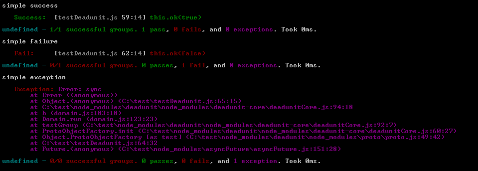
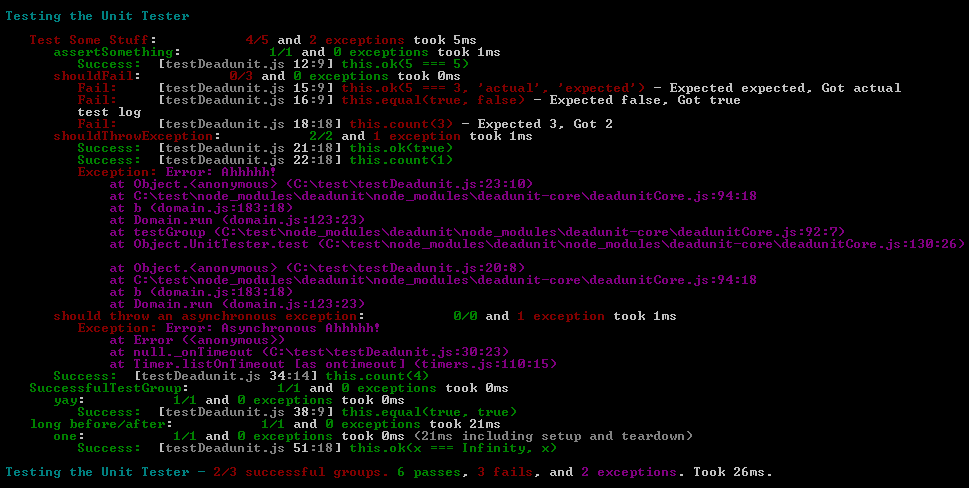
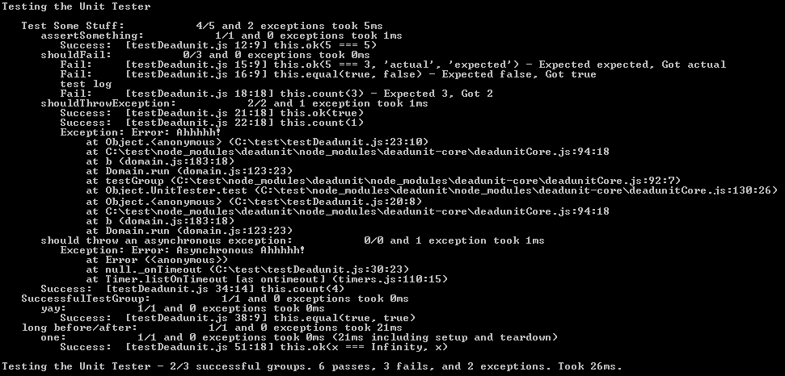
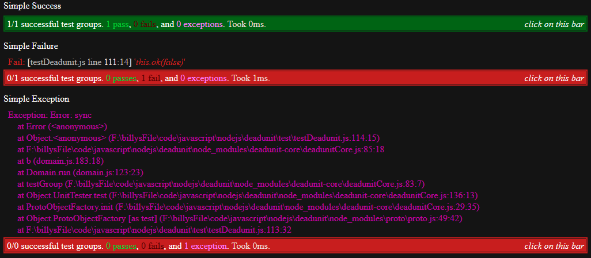
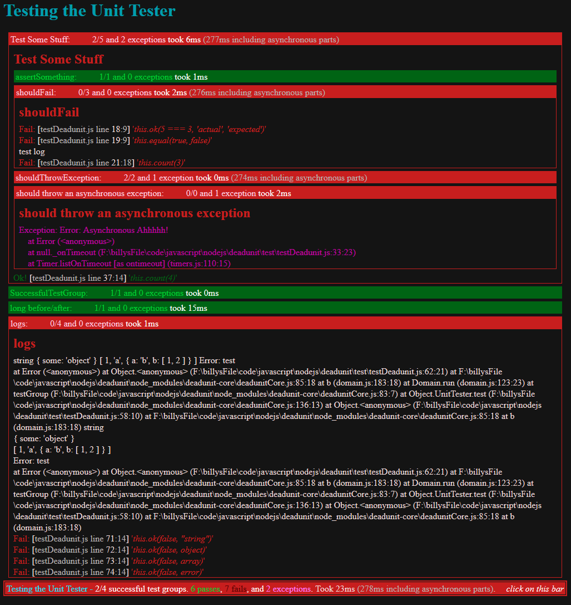

`deadunit`
========

A *dead*-simple nesting unit testing module for testing in node.js and the browser!.
This repository provides default visual representations for the output of [deadunit-core](https://github.com/fresheneesz/deadunitCore),
  as well as a formatter that can be used to easily create custom test visualizations.

Why use it over [Jasmine](http://pivotal.github.io/jasmine/) / [Node-Unit](https://github.com/caolan/nodeunit) / [Wizek's Tree](https://github.com/Wizek/Tree)
==================

 * deadunit's *dead*-simple API only has two major ways to assert behavior (`ok` and `count`) making it easy to learn.
 * deadunit prints the lines of code of asserts in the test results! So your output makes sense even if you don't spend a lot of time writing test commentary.
 * deadunit just uses javascript! It doesn't have an awkward sentence-like api.
 * deadunit's `count` method elegantly solves various issues like expecting exceptions and asynchronous asserts - just `count` up the number of `ok`s!
 * deadunit follows best practices for modular design rather than creating global variables and functions
 * deadunit doesn't provide spies. The use of spies is bad practice as tests should treat the modules they test as black boxes by only testing the public API. The internals of these APIs should be left alone.
 * deadunit is simpler to use because it doesn't provide needless sugar (e.g. Tree's always-pass/always-fail asserts)
 * deadunit doesn't proscribe synchronization for you - it only expects that you tell it how many `ok`s you expect (with `count`) when you have asynchronous assertions.
 * it prints out exception *and* any attached data they have
 * it'll let you know if your code is hanging (something you don't want, but usually goes unnoticed)
 * deadunit supports testing code that uses [node fibers](https://github.com/laverdet/node-fibers)
 * deadunit's output is easier to visually parse than jasmine, or wizek's tree, and much easier than node-unit

Example
=======

```javascript
var Unit = require('deadunit')

var test = Unit.test('some test name', function() {
    this.count(5) // expect all 5 `ok` assertions

    var obj = {x:5, y: 'noty?'}
    this.ok(obj.x === 5)
    this.ok(obj.y === 'y')

    this.test('nested test', function() {
        this.ok(obj.go() > 4)
    })

    try {
    	throw new Error("oops") // exceptions
    } catch(e) {
    	this.ok(true) // expect an exception
    }

    setTimeout(function(result) { // do something asynchronous
        this.ok(result === 'good')
    }, 10)
})

test.writeConsole() // writes colorful output!
test.html()         // returns pretty html!
test.writeHtml(document.body) // writes pretty html to the current page (if you're testing in a browser)!
```

Install
=======

```
npm install deadunit
```

Usage
=====

##### node.js or [webpack](https://github.com/webpack/webpack)
```javascript
var Unit = require('deadunit')
```

##### [webpack](https://github.com/webpack/webpack)
```javascript
var Unit = require('deadunit/deadunit.browser')
```

##### require.js
```javascript
require(['node_modules/browserPackage/deadunit.browser.gen.umd'], function(Unit) {
```

##### browser global-variable
```javascript
<script src="/node_modules/deadunit/browserPackage/deadunit.browser.gen.umd.js"></script>
<script>
var Unit = deadunit.browser.gen
</script>
```

Main Methods
-----------

`Unit.test([<name>, ]<testFunction>)` - runs a suite of unit tests. Returns an ExtendedUnitTest object.

 * `<name>` - (optional) names the test
 * `<testFunction>` - a function that contains the asserts and sub-tests to be run. Both its only parameter and its bound `this` is given the same `UnitTester` object.

`Unit.format(<unitTest>, <printOnTheFly>, <printLateEvents>, <format>)` - creates custom formatted output for test results according to the passed in `<format>`.

* `<unitTest>` is a `UnitTest` (or `ExtendedUnitTest`) object
* `<printOnTheFly>` - if true, events will be printed to the console as they come in
* `<printLateEvents>` - (optional - default true) if true, a warning will be printed when events come in after the results have been written.
* `<format>` - an object containing functions that format the various types of results. Each formater function should return a `String`.
    * `format.assert(result, testName)`
    	* `result` is a deadunit-core [assert result object](https://github.com/fresheneesz/deadunitCore#assert)
        * `testName` is the name of the test the assert is under
    * `format.exception(exception)`
        * `exception` is an exception object (could be any object that was thrown)
    * `format.group(name, totalDuration, totalSynchronousDuration, testCaseSuccesses, testCaseFailures,`
       `assertSuccesses, assertFailures, exceptions, results, exceptionResults, nestingLevel)`
       * `name` is the test group name
       * `totalDuration` - the total duration the test took from start to the last test-action
       * `testCaseSuccesses` - the number of successful asserts (the `ok` method) and groups in this test group. *Does not count asserts and test-groups inside subtest groups*
       * `testCaseFailures` - the number of failed asserts and groups in this test group. *Does not count asserts and test-groups inside subtest groups*
       * `assertSuccesses` - the number of successful asserts in this test group and all subgroups.
       * `assertFailures` - the number of failed asserts in this test group and all subgroups.
       * `exceptions` - the number of exceptions in this test group and all subgroups.
       * `results` - an array of already-formatted test results.
       * `exceptionResults` - an array of already-formatted exceptions.
       * `nestingLevel` is what level of test group this is. The top-level test is at level 0.
    * `format.log(values)`
    	* `values` is an array of logged values

UnitTester
----------

For documentation on how to write unit tests using the following methods, see [deadunit-core](https://github.com/fresheneesz/deadunitCore).

```
this.ok(<success>, [<actualValue>, [expectedValue]])
this.ok(<actualValue>, <expectedValue>)
this.count(<number>)
this.test([<name>, ]<testFunction>)
this.log(<value>, <value2>, ...)
this.timeout(<milliseconds>)
this.before(<function>)
this.after(<function>)
this.error(<function>)
this.sourcemap(<enable>)
```

ExtendedUnitTest
----------------

This object extends [UnitTest from deadunit-core](https://github.com/fresheneesz/deadunitCore#unittest). Also has the following methods:

`test.writeConsole(<hangingTimeout>)` - writes colorized text output to the console. Returns a [future](https://github.com/fresheneesz/asyncFuture) that resolves when the console writing is complete. `<hangingTimeout>` (optional - default 100) is the number of milliseconds to wait for the script to exit after the results have been written. If the script hasn't exited in that amount of time, a warning will be written. If zero, no warning happens. This only applies to node.js. *See below for screenshots.*

`test.writeHtml(<domElement>)` - writes test output to the dom element who's reference was passed to writeHtml. Returns a [future](https://github.com/fresheneesz/asyncFuture) that resolves when the console writing is complete. *See below for screenshots.*

`test.string(<colorize>)` - returns a future that resolves to a string containing formatted test results. `<colorize>` (default false) should only be set to true if it will be printed to a command-line console. *See below for screenshots.*

`test.html(<printLateEvents>)` - returns a string containing html-formatted test results. *See below for screenshots.*
  * `<printLateEvents>` - (optional - default true) if true, a warning will be printed when events come in after the results have been written.

`test.results()` - see [deadunit-core](https://github.com/fresheneesz/deadunitCore#usage). When called from deadunit, doesn't print a warning for late events, use the `events` method if you need to detect that.

### Screenshots ###









Passing tests are closed and failling tests are open by default. Clicking on the bars toggles sections open or closed.


Note about tests with asynchronous parts
========================================

Javascript (and node.js especially) has a lot of asynchronous parts.
Deadunit allows your tests to run asychronously/concurrently, but you have to manage that concurrency.

I recommend that you use either:

* [`fibers/future`s](https://github.com/laverdet/node-fibers#futures),
* or my own [async-futures](https://github.com/fresheneesz/asyncFuture)

On browsers, since there is nothing as nice as node.js Domains, the`window.onerror` handler is used. The `onerror` handler has [many limitations](http://blog.meldium.com/home/2013/9/30/so-youre-thinking-of-tracking-your-js-errors), one of which is that it doesn't currently return an exception object with a stacktrace. If you want to see a more detailed stacktrace for these kinds of errors, check your browser's console (ahem, if you have one - I'm looking at you older versions of IE) because deadunit will not be able to capture and display a stacktrace in its normal output. One goal for most any code is to have 0 unhandled asyncronous exceptions.

Environment/Browser Support
=============

* node.js
* Browsers - note, on browsers, the source is not yet displayed in the output
 * Chrome 31
 * Firefox 26
 * IE 10

This needs more testing! Please help by testing and reporting bugs in other browsers or browser versions!

Todo
====

* Add tap output http://testanything.org/
* Add karma integration
* remove colors from code the browser accesses (again) and consider moving to webpack for your bundle generation
* remove dependency on jquery
* Test deadunit on more browsers and browser versions
* add the ability to stream test results to a browser
* Also see [the todos for deadunit-core](https://github.com/fresheneesz/deadunitCore#to-do)

Known Bugs
===========

* A bug in [`fibers/future`s](https://github.com/laverdet/node-fibers#futures) can cause deadunit to fail to catch errors thrown from a fiber, which can lead to the process to crash prematurely (before printing test results). See https://github.com/laverdet/node-fibers/issues/172

How to Contribute!
============

Anything helps:

* Creating issues (aka tickets/bugs/etc). Please feel free to use issues to report bugs, request features, and discuss changes.
* Updating the documentation: ie this readme file. Be bold! Help create amazing documentation!
* Submitting pull requests.

How to submit pull requests:

1. Please create an issue and get my input before spending too much time creating a feature. Work with me to ensure your feature or addition is optimal and fits with the purpose of the project.
2. Fork the repository
3. clone your forked repo onto your machine and run `npm install` at its root
4. If you're gonna work on multiple separate things, its best to create a separate branch for each of them
5. edit!
6. If it's a code change, please add to the unit tests (in the appropriate test file in the 'test/' folder) to verify that your change works
7. When you're done, run the unit tests and ensure they all pass
   * Make sure you run `node build.js` to build the browser packages (browserPackage/deadunitCore.browser.gen.umd.js and test/deadunitTests.browser.umd.js) before running the browser tests
   * Test the following (lots of it requires visually make sure everything looks right):
    * node test/testDeadunit.node.js
    * open test/allGenerated.node.html in browsers
    * open test/testDeadunitBrowserGlobal.html in browsers
    * open testDeadunit.html in browsers
    * run `node testServer` and open http://localhost:8000/ in browsers
8. Commit and push your changes
9. Submit a pull request: https://help.github.com/articles/creating-a-pull-request

Change Log
=========

* 5.1.7 - updating core
* 5.1.6 - updating core
* 5.1.5 - updating core
* 5.1.4 - updating core to fix "too much recursion" suceptibility
* 5.1.3 - updating core
* 5.1.2 - updating core to pull in some error handling improvements
* 5.1.1 - fixing html display bug caused in last commit
* 5.1.0
    * changing writeHtml to take a dom node instead of a jquery node
    * pulling in new deadunit version to fix a memory leak and to fix firefox stacktrace parsing for their new format (that includes the column number now)
* 5.0.3 - pulling new version of core for a couple things including a huge performance improvement
* 5.0.2 - pulling new version of core to fix annoying bug where eq's expected and got are backwards
* 5.0.1 - updating deadunit-core to pull in a sourcemap fix
* 5.0.0
    * updating deadunit-core to pull in sourcemap support among other things
    * Changing write-on-the-fly to only print out test-groups and unsuccessful asserts
    * fixing issue where sometimes late events wouldn't print the late-event warning https://github.com/fresheneesz/deadunit/issues/16
    * Fixing exception printing in firefox (which was omitting the exception message)
    * Fixing exception printing in-browser so that you get one per line instead of them running together
* 4.1.1 - updating deadunit-core for firefox stackinfo fix
* 4.1.0
    * Switching to not-yet-accepted commit of `colors` that supports a safe mode (where it doesn't modify the String prototype). *Modifying builtins is dangerous*.
    * This comes with a slight API change to deafultformats.text, where you have to pass in the colors module instead of a boolean
* 4.0.4 - updating deadunit-core for a browser-side bug fix
* 4.0.2 - updating deadunit-core
* 4.0.1 - updating deadunit-core to get support for source-code lines in-browser
* 4.0.0 - removing totalSynchronousDuration from format, and upgrading to deadunit-core 4.0.0 (which fixes some timeout problems)
* 3.0.1 - deadunit-core bugfix
* 3.0.0
  * updating to new version of deadunit-core to bring in some improvements (minor breaking change)
* 2.0.15
  * Adding late-events warning text output
* 2.0.13
  * keeping up with deadunit-core, updating for a minor stacktrace display bugfix
* 2.0.12
  * keeping up with deadunit-core
* 2.0.11
  * add generated browser package to repo (since npm post install doesn't work correctly)
* 2.0.10
  * fixing double-printing of exceptions
* 2.0.9
  * attempting to work around an npm bug
* 2.0.4
  * adding browser support
* 2.0.1
  * added a note when a test times out
  * added the ability to warn if the script is hanging after `test.writeConsole` prints out the test
* 2.0.0 - *Breaking Change*
  * incorporating changes in [deadunit-core](https://github.com/fresheneesz/deadunitCore#usage) 2.0.0
  * added `test.results`
  * `test.writeConsole` and `test.html` only return when the test is done (or times out)
  * `test.writeConsole` outputs test results as they happen in addition to outputting the final output
  * removed `test.toString`
  * `test.string` and `test.html` now return futures
* 1.0.7
  * Pretty printing logs other places objects are printed
  * html output
  * handling properties on exceptions

License
=======
Released under the MIT license: http://opensource.org/licenses/MIT
